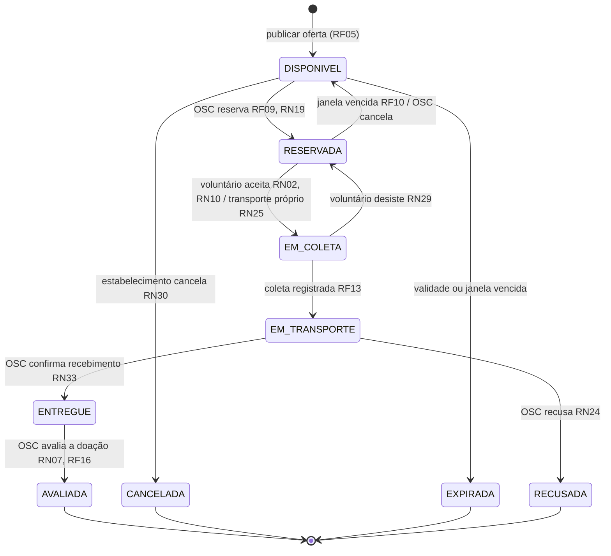

# Diagrama de estados da oferta (EstadoOferta)

```mermaid
stateDiagram-v2
  [*] --> DISPONIVEL: publicar oferta (RF05)
  DISPONIVEL --> RESERVADA: OSC reserva RF09, RN19
  RESERVADA --> DISPONIVEL: janela vencida RF10 / OSC cancela
  RESERVADA --> EM_COLETA: voluntário aceita RN02, RN10 / transporte próprio RN25
  EM_COLETA --> RESERVADA: voluntário desiste RN29
  EM_COLETA --> EM_TRANSPORTE: coleta registrada RF13
  EM_TRANSPORTE --> ENTREGUE: OSC confirma recebimento RN33
  ENTREGUE --> AVALIADA: OSC avalia a doação RN07, RF16
  EM_TRANSPORTE --> RECUSADA: OSC recusa RN24
  DISPONIVEL --> CANCELADA: estabelecimento cancela RN30
  DISPONIVEL --> EXPIRADA: validade ou janela vencida
  AVALIADA --> [*]
  CANCELADA --> [*]
  EXPIRADA --> [*]
  RECUSADA --> [*]
```
